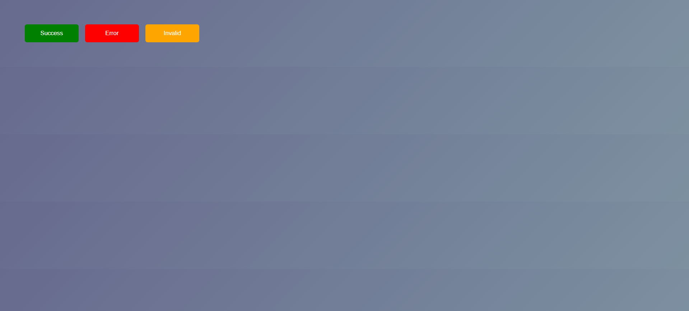
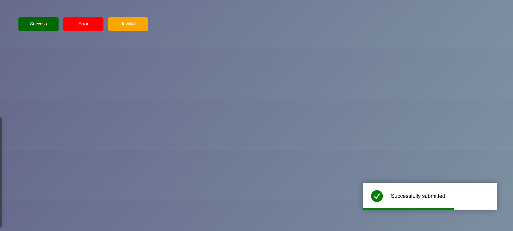
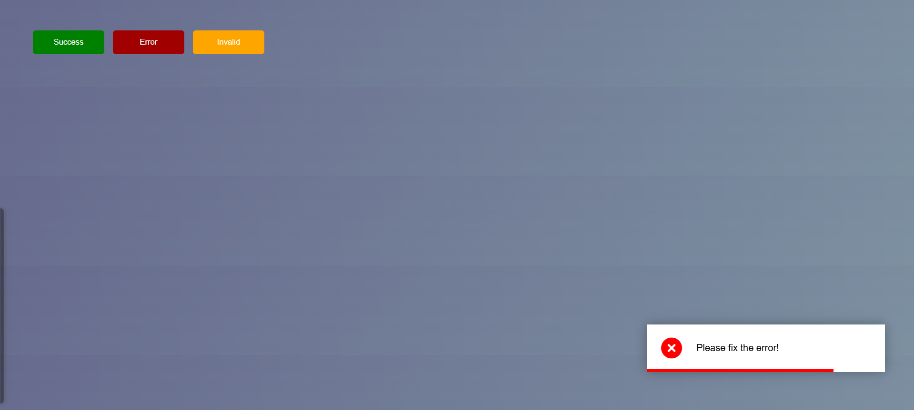
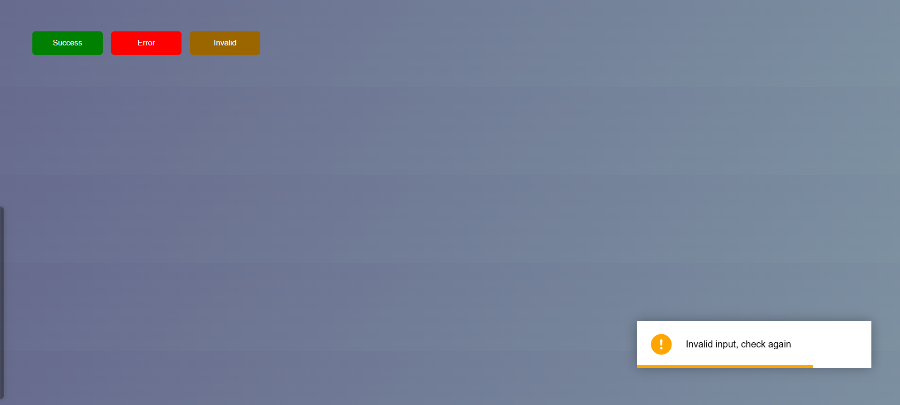
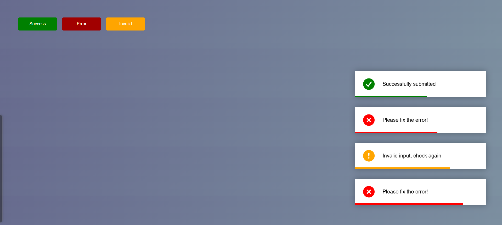

📜 Toast Notification  

A modern and responsive Toast Notification Web Application built using HTML, CSS, and JavaScript. It displays dynamic notifications for success, error, and invalid actions with smooth animations and a clean user interface.  

---  

🚀 Features  

- ✅ Show success, error, and invalid notifications  
- ✅ Smooth slide-in animation  
- ✅ Auto dismiss after a few seconds  
- ✅ Animated progress bar indicator  
- ✅ Icon support using Font Awesome  
- ✅ Responsive design (mobile & desktop)  
- ✅ Clean and modern UI  

---  

🛠️ Technologies Used  

- 👉🏻 HTML5 – Structure  
- 👉🏻 CSS3 – Styling, Animations & Layout  
- 👉🏻 JavaScript (ES6) – Logic & DOM Manipulation  

---  

📂 Project Structure  

toast-notification/  
│── index.html  
│── style.css  
│── script.js  

---  

⚙️ How It Works  

- 1️⃣ User clicks a button (Success / Error / Invalid)  
- 2️⃣ JavaScript creates a new toast dynamically  
- 3️⃣ Toast slides in from the right  
- 4️⃣ Progress bar starts shrinking  
- 5️⃣ Toast disappears automatically after a few seconds  

---  

📸 Preview  

 
 
 
 
 

---  

🧪 Features Handling  

- 1) Dynamic DOM creation using JavaScript  
- 2) Conditional styling based on message type  
- 3) Smooth animations using CSS keyframes  
- 4) Auto removal using setTimeout  
- 5) Progress bar using pseudo-element (::after)  

---  

🌐 Live Demo  

👉🏻 https://suraj-charan-dev.github.io/toast-notification-app/ 

---  

🤝 Contributing  

Contributions are welcome!  

Feel free to fork this repository and submit a pull request.
